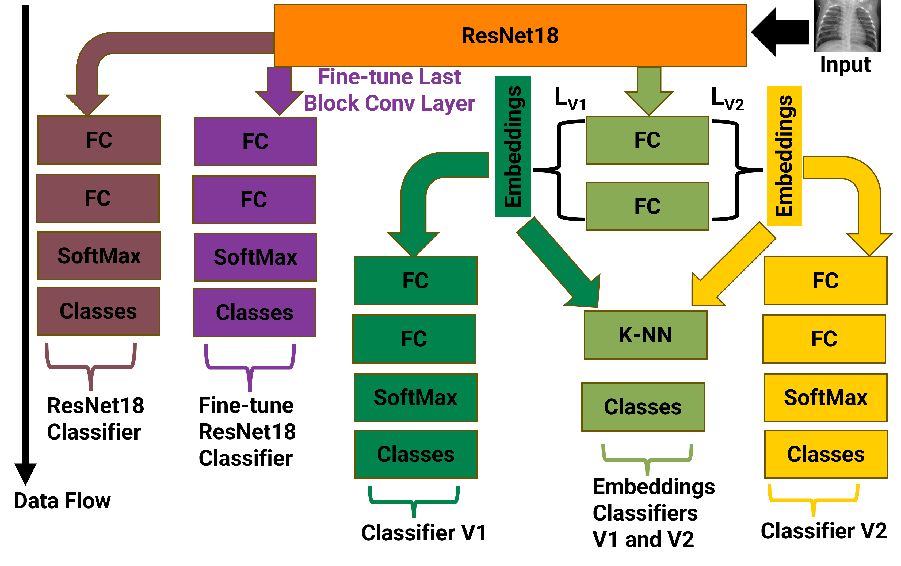

# Deep Learning for Chest X-Ray Radiograph Classification

**Automated pneumonia detection from chest X-rays using ResNet-18 and a custom triplet loss.**  
Coursework project (A+ grade) demonstrating high accuracy (>98%) and advanced deep learning techniques.

---

## Overview
This project was completed as part of my coursework in the **Department of Industrial and Systems Engineering**, where I earned an **A+ grade** for outstanding performance.  
The project applies deep learning techniques to classify chest X-ray radiographs into **pneumonia** and **normal** categories.

---

## Objective
To develop a high-performing model for **automated pneumonia detection** from chest X-ray images using **Convolutional Neural Networks (CNNs)** and **contrastive embedding learning**.  
This approach aims to support clinical diagnosis by providing an efficient and accurate screening tool.

---

## Dataset
The dataset for this project was obtained from **Kaggle**: [Chest X-Ray Images (Pneumonia)](https://www.kaggle.com/paultimothymooney/chest-xray-pneumonia).  
It contains labeled chest X-ray images for **pneumonia** and **normal** cases, and was used for both training and evaluation.

---

## Methodology

### Base Architecture
- Implemented **ResNet-18** as a transfer learning backbone, leveraging pretrained ImageNet weights for strong feature extraction.

### Contrastive Embedding Learning
- Integrated **Triplet Loss** to enhance feature discrimination between pneumonia and normal samples.

### Novel Contribution
- Designed and tested a **new variant of the triplet loss function** that improved class separability and embedding consistency.
- The proposed loss function **outperformed standard formulations** such as Margin Triplet Loss and Soft Triplet Loss.

### Model Architecture

*Figure: Overview of the CNN with ResNet-18 backbone and triplet loss framework.*

### Training Pipeline
- Dataset preprocessing and augmentation  
- Fine-tuning of ResNet-18 layers  
- Learning rate scheduling and weight decay regularization  
- Evaluation with multiple triplet loss formulations

---

## Results

| Metric | Performance |
|--------|------------|
| Classification Accuracy | > 0.98 |
| Precision / Recall      | High for both classes |
| AUC-ROC                 | Excellent class separability |

The proposed model achieved superior performance compared to baseline CNN and standard triplet loss implementations.

---

## Tools & Technologies
- Python  
- PyTorch  
- Torchvision  
- NumPy  
- Pandas  
- Matplotlib  
- scikit-learn  
- Jupyter Notebook  

---

## Key Highlights
- Achieved **A+ grade** for this course project  
- Implemented **transfer learning** using ResNet-18  
- Proposed a **new triplet loss variant** that improved classification performance  
- Attained **over 98% accuracy** on the Kaggle chest X-ray dataset  
- Demonstrated the potential of **deep learning for medical image analysis**

---

## Author
**Raphael N. Ogbodo**  
Department of Chemistry 
University of Iowa  

